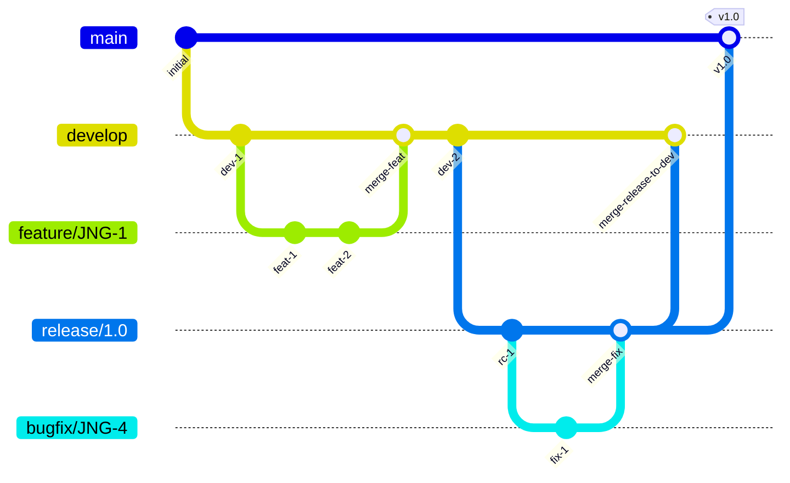
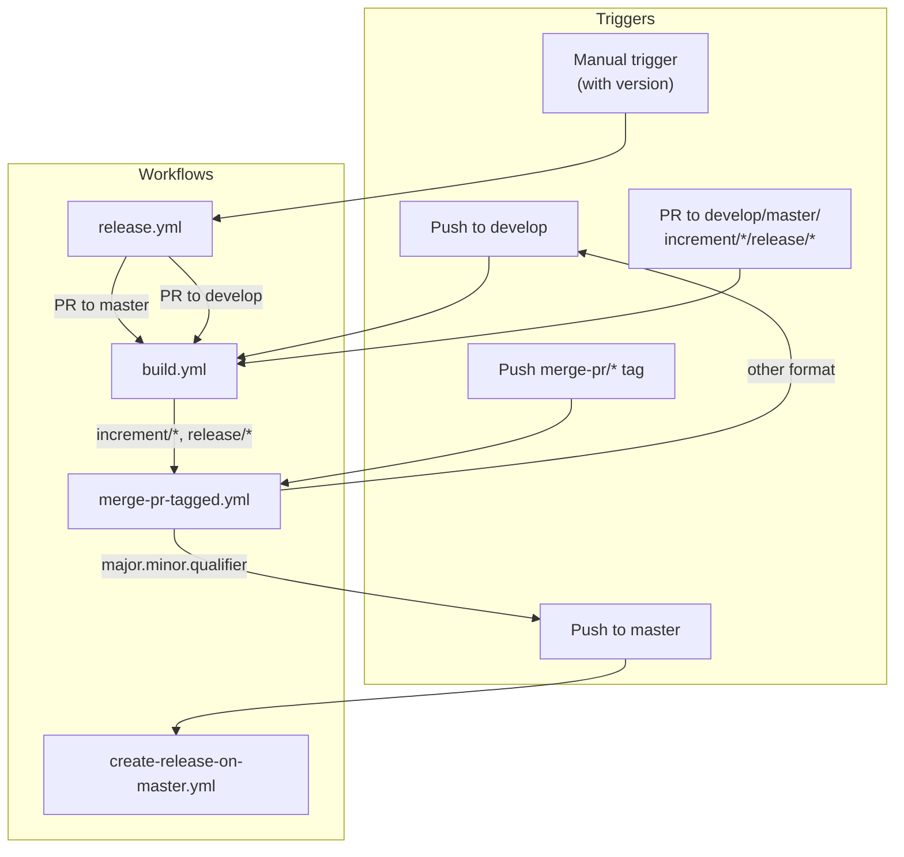
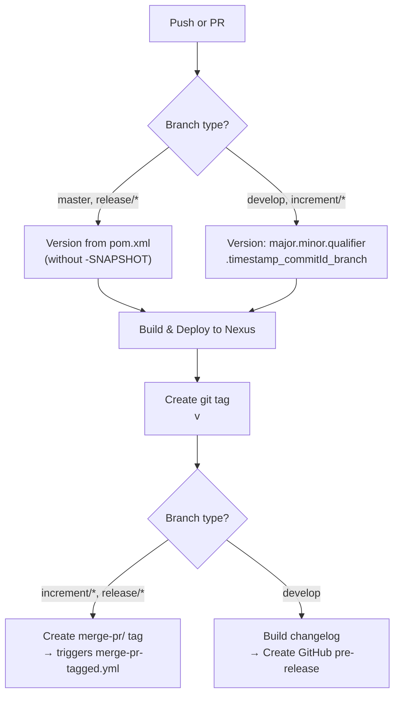
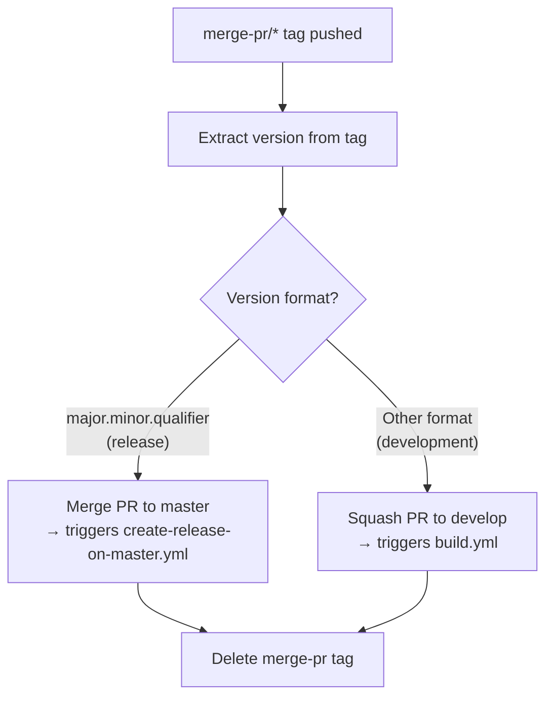

# Development Version and Branch Handling

This document describes the Git branching strategy, version numbering scheme, and CI/CD pipeline used by JUDO NG modules.

## Branching Strategy

The project uses a **GitFlow**-based workflow. All branches serve specific purposes in the release lifecycle:

| Branch Pattern | Purpose | Based On |
|----------------|---------|----------|
| `develop` | Main development branch — contains latest sources of the active version | — |
| `feature/JNG-xxx_summary` | New feature work for the active version | `develop` |
| `release/x.y.z` or `x_y_z` | Release preparation and stabilization | `develop` |
| `bugfix/JNG-xxx_summary` | Fixes for issues found during release testing | Release branch |
| `support/JNG-xxx_summary` | Minor updates to a previous release | Release branch |
| `hotfix/JNG-xxx_summary` | Critical fixes applied to both release and master | `master` |
| `master` | Latest released sources of the active version | Release merges |

## Version Numbers

Version numbers follow **semantic versioning** with these rules:

| Situation | Version Change | Example |
|-----------|---------------|---------|
| Starting a `feature/` branch | No change | — |
| Starting a release branch | 2nd number incremented on `develop` | `1.1.0` → `1.2.0-SNAPSHOT` |
| `bugfix/` branches | No change (fixes go into release before merging to master) | — |
| Starting a `support/` branch | 3rd number incremented | `1.0.0` → `1.0.1` |
| Starting a `hotfix/` branch | 4th number incremented | `1.0.0` → `1.0.0.1` |

### Development vs. Release Versions

- **Development builds** (from `develop` or `increment/*`): `major.minor.qualifier.timestamp_commitId_branchName`
- **Release builds** (from `master` or `release/*`): `major.minor.qualifier` (clean, no SNAPSHOT)

## GitHub Actions Workflows

The CI/CD system is composed of four interconnected workflows that trigger each other:

### build.yml — Main CI Pipeline

Triggers on pushes to `develop` and PRs to `develop`, `master`, `increment/*`, and `release/*` branches.

### merge-pr-tagged.yml — PR Merge Automation

Triggered when a `merge-pr/*` tag is pushed. Routes the PR to the correct target branch based on version format:

### create-release-on-master.yml — Release Publishing

Triggered on pushes to `master`. Creates a GitHub release with a generated changelog.

### release.yml — Manual Release Trigger

Manually triggered with a version parameter (either `auto` to read from pom.xml, or an explicit `major.minor.qualifier` version). Creates two PRs:

1. **PR to `master`** with the release version
2. **PR to `develop`** with the next development version (qualifier + 1)

Both PRs trigger `build.yml` for validation.

## Development Rules

> **Important:** All commits must reference a JIRA ticket number (`JNG-xxx`). There is no commit without a ticket number.

Issue tracking: [JIRA Dashboard](https://blackbelt.atlassian.net/jira/dashboards)
