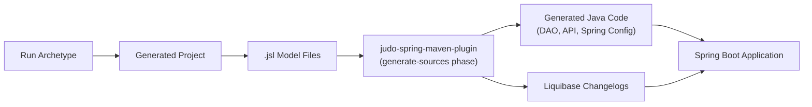

# JUDO JSL Springboot Archetype

[](https://github.com/BlackBeltTechnology/judo-jsl-springboot-archetype/actions/workflows/build.yml)

## Introduction

This project is a **Maven Archetype** that scaffolds new Spring Boot applications with [JUDO JSL](https://documentation.judo.technology) (JUDO Specific Language) support. Instead of manually wiring up Spring Boot with model-driven code generation, you run this archetype and get a ready-to-build project that turns `.jsl` domain model files into a full Spring Boot application — complete with generated DAOs, APIs, Spring configuration, and Liquibase database migrations.

## Context

This project is a building block of the [judo-community](https://github.com/BlackBeltTechnology/judo-community) aggregator project. For a broader understanding of how this fits into the JUDO ecosystem, see the community project documentation.

## How It Works



The archetype generates a Spring Boot project that follows a **model-driven architecture**:

1. You define your domain model in `.jsl` files (a concise DSL for entities, fields, and derived attributes)
2. At build time, `judo-spring-maven-plugin` transforms the model into Java code and database schemas
3. The generated Spring Boot application imports these generated modules and runs them

## Usage

```bash
mvn org.apache.maven.plugins:maven-archetype-plugin:3.1.1:generate -B \
  -DarchetypeGroupId=hu.blackbelt.judo.jsl \
  -DarchetypeArtifactId=judo-jsl-springboot-archetype \
  -DarchetypeVersion=1.0.4 \
  -DgroupId=com.example \
  -DartifactId=hello \
  -DmodelName=Hello
```

## Parameters

| Name | Description | Default Value | Required |
|------|-------------|---------------|----------|
| `modelName` | The name of the JSL model (PascalCase, e.g. `Shop`) | — | Yes |
| `artifactId` | Maven artifact ID for the generated project | `${modelName.toLowerCase()}` | Yes |
| `groupId` | Maven group ID, also used as the base Java package | `com.example` | No |
| `package` | Java package for generated code | `${groupId}.${artifactId}` | No |
| `applicationName` | Name of the Spring Boot main class | `${modelName}Application` | No |
| `version` | Maven version for the generated project | `1.0.0-SNAPSHOT` | No |
| `projectNameSeparator` | Separator character between project name segments (`.` or `-`) | Maven default (`.`) | No |

## Generated Project Structure

Running the archetype creates a project with this layout:

```
<artifactId>/
├── pom.xml                          # Spring Boot parent, JUDO plugin config
├── README.md
├── .gitignore
└── src/
    ├── main/
    │   ├── java/<package>/
    │   │   └── <ApplicationName>.java   # @SpringBootApplication entry point
    │   └── resources/
    │       ├── application.yml          # Spring + JUDO + HSQLDB config
    │       ├── logback.xml
    │       └── model/
    │           └── <ModelName>.jsl      # Sample JSL model with Person entity
    └── test/
        ├── java/<package>/
        │   └── <ApplicationName>Tests.java
        └── resources/
            └── logback-test.xml
```

The sample JSL model defines a `Person` entity with `firstName`, `lastName`, and a derived `fullName` field to demonstrate the DSL syntax.

## Contributing

Everyone is welcome to contribute to JUDO! See the [Contributing Guide](CONTRIBUTING.md) for details.

## License

This project is licensed under the [Eclipse Public License - v 2.0](https://www.eclipse.org/legal/epl-2.0/).
